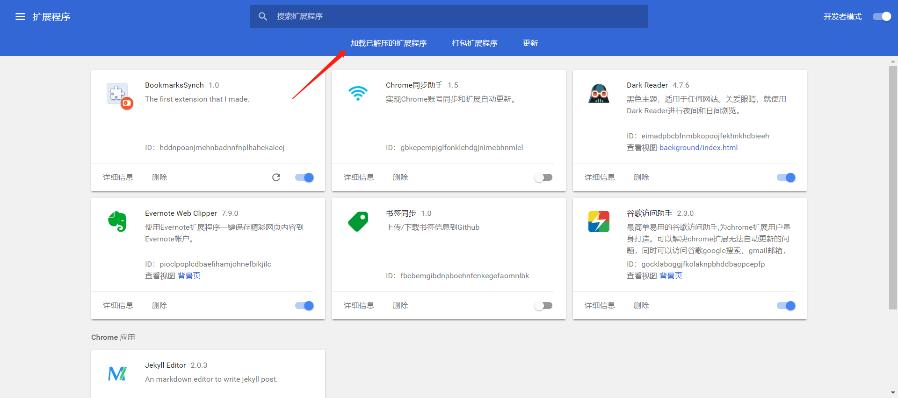
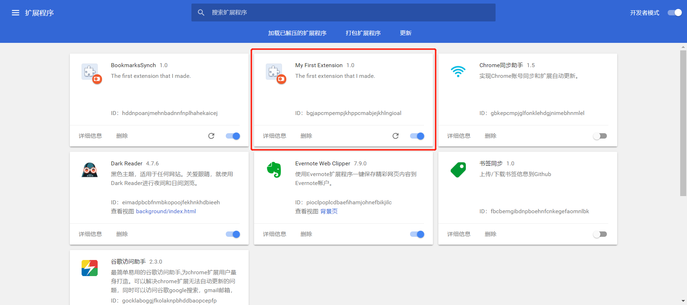
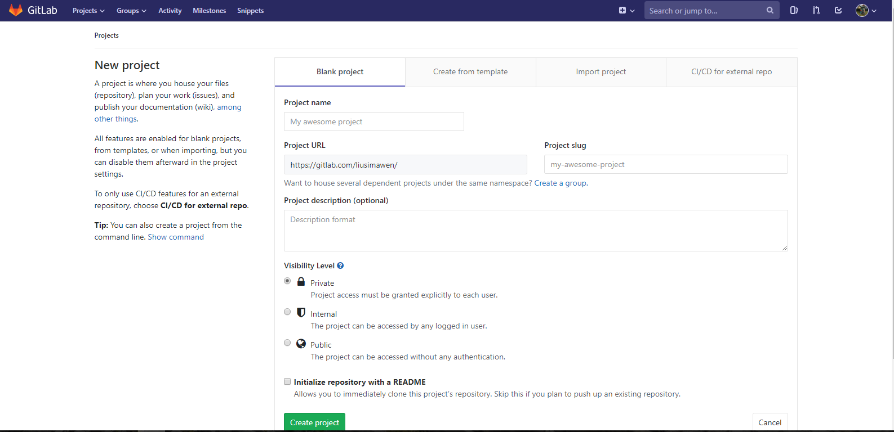
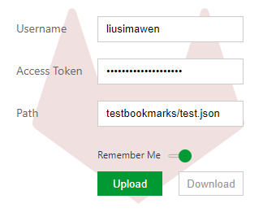
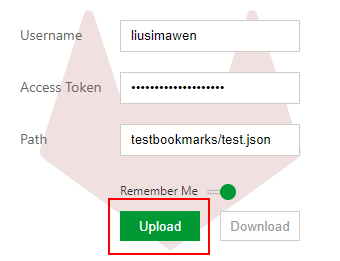
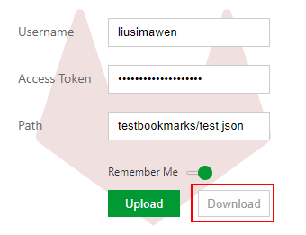
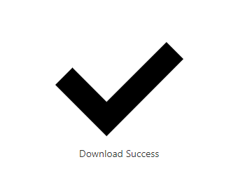

# 谷歌浏览器书签同步工具

本谷歌浏览器扩展程序借助于gitlab实现了不同PC之间的谷歌浏览器<strong>书签数据的同步功能</strong>,json格式的书签经过base64编码，
不必担心隐私的泄露。
 由于该扩展程序并没有上线chrome网上应用店，因此如果需要体验的话，需要从浏览器扩展程序中手动添加。
## 操作演示
### 添加扩展程序
1.浏览器输入chrome://extensions/ 
2.点击“加载已解压的扩展程序”按钮，设置路径到GoogleBookmarkSynchExtension文件夹。 

  
 
3.添加成功后如下图。 

  
 

### gitlab生成token

  
 

### gitlab新建Project[testbookmarks]，并添加保存书签的文件[test.json] 

  
 

### 输入gitlab用户名，token，以及用以保存书签的文件的路径

  
 

### 初始使用，首先点击“upload”按钮，上传本地的书签数据。当切换电脑时，在新电脑上点击“download”按钮，会将gitlab上的书签覆盖至本地，达到书签同步的目的
#### <h2>upload</h2>

  
 

  
 

#### <h2>download</h2>

  
 

  
 